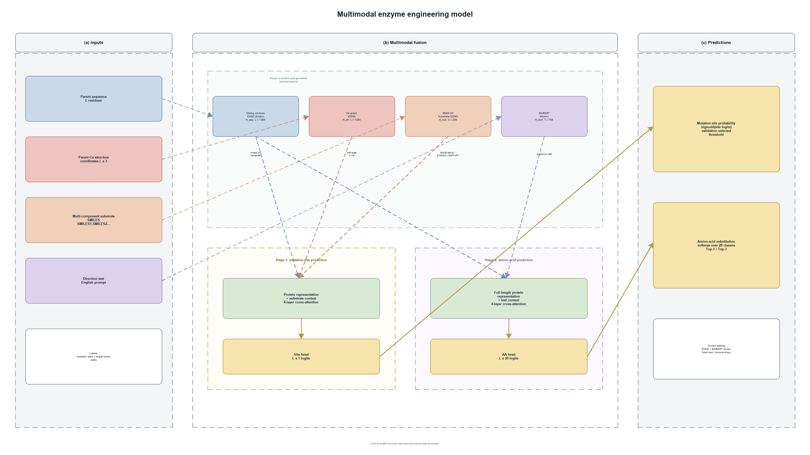

# Multimodal Enzyme Engineering

An open, work-in-progress project for machine learning-guided enzyme
engineering.

The project combines:

- protein sequence
- protein structure
- substrate molecular representation
- text-based engineering objectives

The current repository focuses on data curation, positive-variant extraction,
structure and substrate preprocessing, and a multimodal baseline for predicting
mutation sites and amino-acid substitutions.

> This project is under active development. The current code is a research
> baseline, not a production-ready mutation-design system.



## Project Status

Implemented or partially implemented:

- extraction of positive variants relative to an experiment-specific parent
- generation of English direction text from parent-relative metrics
- mmCIF parsing and C-alpha coordinate projection
- RDKit-based substrate 3D conformer generation
- ESM2-style sequence encoding with overlapping windows
- BioBERT-style direction-text encoding
- EGNN-style protein and substrate geometry encoders
- experiment-level train/validation/test splitting
- two residue-level prediction heads:
  - mutation-site prediction
  - amino-acid substitution prediction

Still being refined:

- Stage 1 to Stage 2 soft-mask coupling
- structure provenance and sequence-identity auditing
- EC 5 and IRED data adapters
- robust multi-metric label definitions
- full training and ablation studies

## Repository Layout

```text
multimodal-enzyme-engineering/
├── README.md
├── requirements.txt
├── .gitignore
├── multimodal_baseline/
├── scripts/
├── configs/
├── docs/
└── figures/
```

Raw experiment tables, pretrained model weights, checkpoints, paper PDFs and
large generated artifacts are intentionally excluded from this repository.

## Data Pipeline

```text
raw experiment CSV
    -> identify parent and variants
    -> compare performance metrics with the parent
    -> retain positive variants and parent records
    -> generate direction text
    -> attach parent structure
    -> generate substrate 3D with RDKit
    -> build manifest.jsonl
    -> train residue-level prediction heads
```

The detailed project explanation is available in
[`docs/q&a.md`](docs/q%26a.md).

## Installation

```bash
python -m venv .venv
source .venv/bin/activate
pip install -r requirements.txt
```

On Windows PowerShell:

```powershell
.\.venv\Scripts\Activate.ps1
```

For GPU training, install the PyTorch build appropriate for the target CUDA
version before installing the remaining dependencies.

## Preparing Data

The manifest builder expects the curated data directories described in
`docs/q&a.md`. Those datasets are not included in this public code snapshot.
Once the data are placed in the expected paths, run:

```bash
python -m multimodal_baseline.prepare_data \
  --output-dir multimodal_baseline_artifacts
```

This produces:

- `manifest.jsonl`
- `experiment_splits.json`
- `split_summary.csv`
- `vocab.json`
- `manifest_summary.csv`

## Dry Run

```bash
python -m multimodal_baseline.train \
  --artifacts-dir multimodal_baseline_artifacts \
  --dry-run
```

## Training

A Linux GPU command template is provided at
[`configs/train_server_template.sh`](configs/train_server_template.sh).

The model can use local Hugging Face-compatible checkpoints through:

```bash
python -m multimodal_baseline.train \
  --artifacts-dir multimodal_baseline_artifacts \
  --device cuda \
  --seq-pretrained-dir path/to/esm2_t33_650M \
  --text-pretrained-dir path/to/biobert-v1.1 \
  --freeze-seq-backbone \
  --freeze-text-backbone
```

The pretrained model directories are not included in this repository.

## Model Overview

The current baseline has two branches:

1. Stage 1 combines parent sequence, parent C-alpha structure and substrate
   geometry to predict a mutation probability for every residue.
2. Stage 2 combines parent sequence and direction text to predict one of the
   20 standard amino acids at every residue.

The current implementation keeps the two heads residue-aligned. The
cross-stage soft gate described in the project plan is still a future
extension.

## Data and Reproducibility

Before releasing datasets, verify:

- data licensing and publication permissions
- removal of private or unpublished records
- structure and sequence provenance
- exact preprocessing configuration
- model and dataset version identifiers

## Citation

This repository is a research work in progress. A formal citation will be
added when the dataset and model study are finalized.
