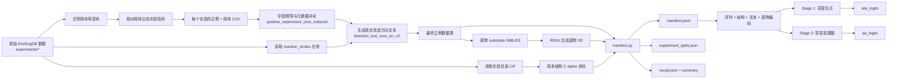

# 酶定向进化多模态项目 Q&A

> 本文描述的是截至 2026-09-05 的实际状态。

## 1. 项目是在解决什么问题？

项目面向酶的定向进化数据，目标是训练一个融合**文本、蛋白质序列、蛋白质结构和底物分子**的模型，学习：

1. 蛋白质序列中哪些残基更适合进行突变；
2. 这些位置更可能突变成哪一种氨基酸。

最终希望模型根据一个酶的母本序列、结构、底物和改造目标，给出可实验验证的突变位点和氨基酸替换建议。

当前研究阶段仍然是**数据整理、结构化和基线模型验证阶段**，还不能把模型描述成已经完成可靠的突变设计系统。

## 2. 整个项目的数据流是什么？



一条样本的核心关系是：

```text
母本序列 + 母本结构 + 底物 SMILES + 改造方向文本
                         |
                         v
             模型预测突变位点和替换氨基酸
                         ^
                         |
       正例变体的真实突变位点和目标氨基酸作为标签
```

需要特别注意：**变体序列通常不是模型的前向输入，而是用来生成监督标签**。模型输入是母本条件，模型学习如何提出变体。

## 3. 原始数据放在哪里？

### 3.1 `experiments`

当前 `experiments` 下有 140 个实验目录。每个实验目录目前包含：

- 一个原始实验 CSV；
- 一个 CIF 结构文件；
- 一个 JSON 元数据文件。

原始 CSV 主要包含：

- 实验 ID 和变体 ID；
- 母本/变体标记；
- 母本序列和变体序列；
- `amino_acid_substitutions`；
- `reaction_smiles`、底物或产物信息；
- `fitness_value`、`yield`、`TTN`、`TOF`、`ee`、`selectivity` 等实验结果；
- 部分实验的测序或质量控制字段。

JSON 中还保存了实验标题、DOI、底物、产物、母本序列、实验条件等元信息。

### 3.2 当前主要派生数据目录

| 目录 | 作用 |
|---|---|
| `positive_experiment_csvs` | 每个实验筛出的正例及对应母体 |
| `positive_experiment_csvs_reduced` | 精简字段，并补充 `parent_sequence`、`ec_class` 等元数据 |
| `direction_text_csvs_en_v3/positive_experiment_csvs_reduced_rewritten` | 当前主要正例数据源，带英文改造方向文本 |
| `direction_text_csvs_en_v3/ec3-*-reduced` | 手工整理的 EC 3 数据 |
| `downloaded_structures/ec3` | EC 3 数据使用的结构文件 |
| `multimodal_baseline_artifacts` | 模型训练所需的 manifest、词表、数据拆分和汇总 |

## 4. 正例变体是怎么定义的？

当前批处理脚本是 [`generate_positive_datasets.py`](../scripts/generate_positive_datasets.py)。

### 母体识别

普通实验优先根据 `amino_acid_substitutions` 的值识别母体，例如：

- `#PARENT#`；
- `parent`。

特殊实验 `ARNLD-0917-39903c09-5dc0-4cc8-b805-a5739a835e85` 单独使用：

- `nucleotide_mutation` 中包含 `parent` 的行作为母体。

这条特殊规则只针对该实验，不会影响其他实验。

### 质量控制

当前正例数据导出阶段保留的主要 QC 规则是：

```text
如果存在 alignment_count，则要求 alignment_count >= 4
```

早期统计曾使用过 `alignment_count >= 10`，但为了获得更多训练样本，后续放宽到了 4。当前 `generate_positive_datasets.py` 不再把 `alignment_probability` 和 `p_value` 作为统一过滤条件。

### 正例判断

脚本从当前 CSV 中识别结果指标，候选字段包括：

- `yield`
- `conversion`
- `ttn`
- `TTN (if applicable)`
- `ton`
- `tof`
- `ee`
- `selectivity`
- `activity_for_reaction_% (if applicable)`
- `fitness_value`

对每个变体，先按反应上下文寻找对应母体，优先使用 `reaction_smiles` 等字段进行配对。然后对可比较的结果指标执行 OR 判断：

```text
只要任意一个结果指标：
    变体值 > 对应母体值
则该变体为正例
```

如果没有任何指标提高，但至少有指标降低，则记为负例；如果所有可比较指标都持平，则记为 tie。一个指标提高、另一个指标降低时，当前代码会优先归为正例，因为正例判断先执行。

### 输出母体的方式

原始正例导出阶段会把母体行和正例行写入同一个实验 CSV。母体按上下文 key 去重后写入，因此“每个实验只保留一个母体”在存在多个反应上下文时应理解为：

```text
每个母体上下文保留一次，而不是无条件对整个 CSV 只保留一行。
```

之后进入模型 manifest 时，母体序列、结构等字段会被复制到每个训练样本的记录中。这不是重复的原始数据，而是每条“母本条件 -> 一个变体标签”训练样本都需要完整输入。

## 5. 为什么需要生成 direction text？

同一条变体除了序列变化，还需要一个自然语言目标，告诉模型这条实验记录希望改善什么性质。

文本重写脚本是 [`generate_positive_experiment_direction_texts_rewrite.py`](../scripts/generate_positive_experiment_direction_texts_rewrite.py)。它会：

1. 找到母体行；
2. 找到结果指标列；
3. 将变体值和母体值比较；
4. 生成真实指标名称和相对变化；
5. 输出多个英文表达版本。

例如：

```text
Aim to improve fitness value and TTN;
fitness value improved from 20 to 24;
TTN improved from 20 to 24.
```

当前文本生成原则包括：

- 使用真实指标名称，不把 `yield` 错写成 `reaction activity`；
- 母体值是比较基准；
- 一个变体改善多个指标时，文本可以列出多个指标；
- `trace`、`below LOQ`、`LOQ` 等低于定量限的信息应明确保留；
- 底物优先取 `substrate` 字段；
- 如果 `substrate` 缺失，可由 [`sync_substrate_from_raw_experiments.py`](../scripts/sync_substrate_from_raw_experiments.py) 从原始 `reaction_smiles` 的 `>>` 左侧补回。

EC 3 的若干文件是单独整理并填充文本的，因此它们的字段和文本格式可能与自动生成的正例文件略有不同。

## 6. `experiments` 里的 CIF 是不是母本结构？

当前代码把每个实验目录中的第一个 CIF 当作该实验的参考蛋白结构：

```python
experiments/<experiment_id>/*.cif
```

这在当前数据流中被作为母本结构使用，但需要区分两件事：

1. **工程使用方式**：代码确实把它作为该实验的 `parent_3d` 输入；
2. **来源事实**：不能只凭文件存在就断言它一定是实验母本的实验解析结构。

当前抽样的 CIF 文件头显示有 `Chai-1 predicted structure` 和 `computational` 等信息，说明至少部分结构是计算预测结构，而不是晶体结构。EnzEngDB 论文可以确认数据库会保存 CIF 并提供蛋白结构展示，但不能替代逐个文件的结构来源核验。

当前结构处理代码是 [`multimodal_baseline/mmcif.py`](../multimodal_baseline/mmcif.py)，处理步骤如下：

1. 读取 mmCIF 的 `_atom_site` 表；
2. 只取蛋白 C-alpha 原子；
3. 选择残基数最多的链；
4. 默认只读取第一个模型；
5. 将三字母氨基酸转换为单字母；
6. 将结构序列和 CSV 中的母本序列做全局序列比对；
7. 将结构坐标投影到母本序列位置；
8. 对缺失结构的残基使用坐标 mask 标记。

因此 manifest 中的结构字段是：

- `parent_3d_path`：结构文件路径；
- `parent_3d_seq`：从 CIF 解析出的结构链序列；
- `parent_3d_coords`：对齐到母本序列后的残基坐标；
- `parent_3d_mask`：该母本位置是否有有效结构坐标。

当前管线尚未自动完成“CIF 结构与母本序列身份、链选择和结构来源”的严格质量审计。正式论文中应把结构称为“参考/预测结构”还是“实验结构”，需要根据数据来源进一步确认。

## 7. EC 3、EC 5 和 IRED 的情况是什么？

### EC 3

当前 `manifest.py` 显式接入了：

- `ec3-1_reduced`
- `ec3-2_reduced`
- `ec3-3_reduced`
- `ec3-4_reduced`
- `ec3-6_reduced`

EC 3 的结构从 `downloaded_structures/ec3` 按文件名匹配，例如 `ec3-1_1EX9.cif`。

代码中把这些数据统一设置为 `ec_major = 3`，因此它们属于 EC 3 大类，但不会进一步区分 EC 3.1、3.2 等子类。

### EC 5

当前 `manifest.py` 没有 EC 5 数据源，`idea.md` 中也记录过 EC 5 尚未整理完成。因此当前训练 manifest 不包含 EC 5。

接入 EC 5 至少需要准备：

- 母本和正例变体；
- 统一的底物/反应 SMILES；
- 可比较的实验指标；
- 母本序列；
- 突变位点和突变后氨基酸；
- 对应结构或明确的结构缺失标记；
- 与其他数据一致的 `record_role`、`is_positive` 和文本字段。

### IRED

`ired` 目录不是普通的 EnzEngDB 实验目录，而是 IRED 长读长深度突变扫描数据。当前共有 6 个 CSV：

- `pcired-tecalcet-active_data.csv`
- `pcired-tecalcet-active_data - copy.csv`
- `srired-chx_cpa-active_data.csv`
- `srired-chx_cpa-inactive_data.csv`
- `srired-chx_menh2-active_data.csv`
- `srired-mepy-active_data.csv`

这些文件包含：

- `aa_seq`；
- 与野生型的氨基酸汉明距离；
- `fitness`、`sigma`；
- 输入/输出计数；
- active/inactive 标记或不同时间点、重复实验的统计字段；
- 部分文件中的 `WT`、`indel`、`STOP` 等质量信息。

IRED 论文说明，这类数据来自长读长深度突变扫描，通过输入/筛选后序列计数计算 fitness，能够同时覆盖单突变和多突变，并包含 active 与 inactive 变体。因此它**有潜力成为非常有价值的扩展数据源**，尤其适合增加负例和连续 fitness 信息。

但 IRED 目前不能直接放进当前 manifest，原因是它还没有转换为当前管线需要的统一格式：

- 没有统一的 `record_role` / `is_positive`；
- 母本行需要从 `WT` 或论文信息中明确恢复；
- 需要确认每个文件对应的反应、底物和实验条件；
- fitness 的方向、归一化方式和 active/inactive 判定要统一；
- 需要由 `aa_seq` 与母本序列计算 `amino_acid_substitutions`；
- 需要处理 stop、indel、异常序列和重复文件；
- 需要绑定 `downloaded_structures/ired/SrIRED_5OCM.cif` 等结构；
- 需要决定 IRED 的母本是 SrIRED、PcIRED，还是每个 campaign 各自的 WT。

结论是：**IRED 可以使用，但应作为独立数据适配阶段接入，不建议直接把原始 CSV 混入当前正例目录。**

## 8. 当前模型真正使用哪些输入？

当前模型主入口是 [`multimodal_baseline/model.py`](../multimodal_baseline/model.py)。

### 输入

当前前向计算需要：

1. `parent_sequence_raw`：母本氨基酸序列；
2. `coords`：母本残基 C-alpha 坐标；
3. `coord_mask`：坐标有效性；
4. `text_ids` 和 `text_attention_mask`：改造方向文本；
5. `ligand_atom_features`：底物原子特征；
6. `ligand_atom_coords`：底物原子 3D 坐标；
7. `ligand_atom_mask`：底物原子 padding mask；
8. `ligand_component_ids`：原子属于哪个底物组分。

`idea.md` 中的“配体可选”是设计想法，但当前 `model.py` 会检查底物几何输入是否存在，因此**当前实现实际上要求底物几何输入**。

### 四种模态及编码器

| 模态 | 当前编码器 | 作用 |
|---|---|---|
| 蛋白序列 | `HFSequenceEncoder`，可加载 ESM2 | 提取残基级序列表示 |
| 蛋白结构 | `EnzyGen2StructureEncoder` | 基于 C-alpha 坐标和 EGNN 建模空间关系 |
| 改造文本 | `HFBioBERTStyleEncoder`，可加载 BioBERT | 编码实验目标和方向 |
| 底物分子 | `SubstrateGeometryEncoder` | 编码底物组分、原子特征和 3D 几何 |

本地模型目录中已经存在：

- `local_models/esm2_t33_650M`
- `local_models/biobert-v1.1`

ESM2 目录中有约 650M 参数级别的权重文件，BioBERT 目录中有 PyTorch 权重和词表。因此本地模型文件是存在的，但训练显存和运行速度仍然是服务器侧问题。

## 9. 长蛋白序列如何处理？

ESM2 序列编码器支持滑动窗口：

```text
window_size = 512
overlap = 256
```

处理流程是：

1. 将超过窗口长度的母本序列切成重叠片段；
2. 第一段添加起始特殊 token；
3. 最后一段添加结束特殊 token；
4. 中间窗口只编码残基片段；
5. 将各窗口中的残基表示映射回原始序列位置；
6. 对重叠位置取覆盖平均；
7. 得到一条完整、与母本残基位置对齐的表示；
8. 再执行结构融合和文本/底物融合。

因此，模型的最终输出仍然是按母本序列长度对齐的残基级结果，而不是窗口级结果。

## 10. Stage 1 和 Stage 2 做什么？

### Stage 1：突变位点预测

当前代码中的 Stage 1 流程是：

```text
母本序列表示 + 母本结构表示
                    |
                    v
       与底物几何表示做 Cross-Attention
                    |
                    v
       site_head: 每个残基输出 1 个 logit
```

输出：

```text
site_logits: [batch_size, sequence_length]
```

训练时使用每个突变位置的二分类标签，评估时通过 sigmoid 转为概率，并计算 F1、Recall 和 AUC。

### Stage 2：突变氨基酸预测

当前代码中的 Stage 2 流程是：

```text
母本序列表示
       |
       v
与 direction text 做 Cross-Attention
       |
       v
aa_head: 每个残基输出 20 个氨基酸类别 logit
```

输出：

```text
aa_logits: [batch_size, sequence_length, 20]
```

训练时只在真实突变位置计算氨基酸分类损失，评估 `Top-1` 和 `Top-3` 准确率。

### 一个重要的实现差异

`idea.md` 计划的是：

```text
Stage 1 的 site probability
        -> soft mask / soft gate
        -> Stage 2 的氨基酸预测
```

但当前 `model.py` 中 Stage 2 没有读取 `site_logits`，也没有使用 site probability 对 Stage 2 表示做 soft mask。当前两条分支共享序列编码器，但 Stage 2 是独立的文本融合分支。

所以对外介绍时应说：

```text
当前版本实现了两个残基级预测分支；
跨阶段 soft mask 是下一步需要补上的设计。
```

## 11. 底物 3D 是怎么来的？

当前底物处理代码是 [`multimodal_baseline/ligand3d.py`](../multimodal_baseline/ligand3d.py)。

### SMILES 到分子图

如果底物 SMILES 中包含多个组分，例如：

```text
substrate_A.substrate_B.co-factor
```

代码按 `.` 拆分成多个分子组分，并保留每个原子的 component ID。

### RDKit 生成 3D

对每个组分：

1. 使用 RDKit 从 SMILES 解析分子；
2. 加氢；
3. 使用 ETKDGv3 生成 3D 构象；
4. 优先进行 MMFF 优化，失败时尝试 UFF；
5. 去除氢；
6. 合并各组分的原子特征和坐标；
7. 对整体坐标做中心化。

当前每个原子使用 5 维特征：

```text
原子序数
总度数
形式电荷
氢原子数
杂化类型
```

底物几何图使用 `k=12` 的组内 KNN 图，之后用 substrate EGNN 编码，再对多个分子组分做 Transformer 聚合。

这意味着当前不是直接从原始 CSV 读取底物 3D，而是：

```text
CSV substrate SMILES
        -> RDKit 离线生成 3D
        -> 原子特征 + 坐标 + component ID
        -> substrate EGNN
```

如果 SMILES 非法，manifest 中会记录 `substrate_3d_status=failed` 及错误信息。此前 `ARNLD-7875` 的 `[N2]CC#N` 就属于这种问题，后来已根据论文信息修正底物表示。

## 12. manifest 是怎样生成的？

入口是：

```bash
python -m multimodal_baseline.prepare_data --output-dir multimodal_baseline_artifacts
```

核心逻辑在 [`multimodal_baseline/manifest.py`](../multimodal_baseline/manifest.py)。

### 当前接入的数据源

`manifest.py` 当前显式读取：

1. `direction_text_csvs_en_v3/positive_experiment_csvs_reduced_rewritten`
2. `direction_text_csvs_en_v3/ec3-1_reduced`
3. `direction_text_csvs_en_v3/ec3-2_reduced`
4. `direction_text_csvs_en_v3/ec3-3_reduced`
5. `direction_text_csvs_en_v3/ec3-4_reduced`
6. `direction_text_csvs_en_v3/ec3-6_reduced`

它不会直接读取原始 `experiments` 作为训练样本，也不会读取 `ired`。

### 一条样本如何构造？

对每个实验：

1. 读取 CSV；
2. 找到母体行；
3. 只保留 `is_positive` 或 `record_role` 表明为正例的变体；
4. 排除删除、插入和 indel；
5. 读取母本序列；
6. 读取变体序列；
7. 从 `amino_acid_substitutions` 解析突变位置和目标氨基酸；
8. 如果没有变体序列，则尝试根据替换描述改写母本序列；
9. 如果没有完整突变位点，则尝试从母本/变体序列差异推导；
10. 绑定结构文件；
11. 绑定底物 SMILES，并用 RDKit 生成底物 3D；
12. 读取 direction text；
13. 写入一条 JSONL 样本记录。

一条 manifest 样本至少包含：

```text
parent_sequence
parent_3d_coords
parent_3d_mask
substrate_smiles
substrate_atom_features
substrate_atom_coords
variant_aa_sequence
amino_acid_substitutions
mutation_sites
mutation_targets
direction_text
is_positive
```

## 13. 突变位点标签是什么？one-hot 是什么？

例如母本序列中：

```text
...A...
```

变体把第 37 位的 A 换成 L，替换字段可能是：

```text
A37L
```

代码会提取：

```text
mutation_sites = [37]
mutation_targets = ["L"]
```

### Stage 1 标签

假设母本长度为 6，只有第 3 位发生突变，则位点标签是：

```text
[0, 0, 1, 0, 0, 0]
```

它表示每个位置是否为突变位点。

### Stage 2 标签

Stage 2 在真实突变位置记录目标氨基酸。例如第 3 位突变为 L：

```text
aa_target[3] = index("L")
```

其他未突变位置不参与氨基酸分类损失，代码用 `-100` 表示忽略。

因此这里的“one-hot”可以理解为：

- 位点任务：每个位置一个 0/1 标签；
- 氨基酸任务：目标氨基酸在 20 个标准氨基酸类别中对应一个类别索引，训练时等价于 one-hot 分类目标。

## 14. 训练集和测试集如何划分？

当前代码按 EC 大类分层，并且以**实验为单位**划分，而不是随机把同一实验的行拆到训练集和测试集。

默认流程：

```text
每个 EC 大类内部：
    约 80% 实验 -> train
    约 20% 实验 -> test

训练阶段再从 train 实验中：
    约 10% 实验 -> val
```

这样做的主要目的是防止同一个实验的母本、底物、反应条件和变体同时出现在训练和测试中，造成数据泄漏。

需要注意：`idea.md` 中写的是“每类选 80% 酶种作为训练集”，而当前代码实现的是“每类按实验划分 80/20”。如果后续要严格按酶种划分，需要额外定义“酶种”的字段和分组规则。

## 15. 损失函数和评估指标是什么？

当前训练代码是 [`multimodal_baseline/train.py`](../multimodal_baseline/train.py)。

### Stage 1

- 默认使用二元交叉熵；
- 支持 focal BCE；
- 支持正例权重；
- 可选 label smoothing；
- 输出 `site_logits`；
- 推理阶段用 sigmoid；
- 验证集搜索最佳 site threshold。

### Stage 2

- 使用 20 类交叉熵；
- 只对真实突变位置计算损失；
- 支持氨基酸标签平滑；
- 输出 `aa_logits`；
- 评估 Top-1 和 Top-3。

总损失形式为：

```text
total_loss = site_loss_weight * site_loss + aa_loss
```

当前主要指标：

- Stage 1：`F1`、`Recall`、`AUC`；
- Stage 2：`Top-1`、`Top-3`。

## 16. 当前代码有哪些需要注意的缺口？

这些问题不妨碍理解整体数据流，但在正式训练和论文描述前应处理。

### 16.1 Stage 2 尚未接入 Stage 1 soft mask

这是当前设计和实现最重要的差异。需要决定：

- 是否把 `sigmoid(site_logits)` 作为 Stage 2 的 soft gate；
- 是使用 detached probability，还是允许 Stage 2 梯度回传到 Stage 1；
- 是否对 site probability 做温度、阈值或归一化。

### 16.2 预训练骨干冻结策略

公开代码快照已经在 `MultimodalEnzymeBaseline` 中补齐：

```text
freeze_seq_backbone
freeze_text_backbone
```

启用后会将 ESM2 和 BioBERT 主干参数设置为不参与梯度更新，但新增加的投影层、融合层和预测头仍然可以训练。服务器模板默认启用这两个选项，以降低显存和过拟合风险。

### 16.3 当前 artifact 可能不是最新数据的反映

`multimodal_baseline_artifacts` 是生成产物。如果正例 CSV、EC3 文件或底物字段之后发生修改，需要重新运行 `prepare_data.py`，不能只根据旧的 `manifest_summary.csv` 判断当前数据规模。

### 16.4 结构来源仍需做 provenance 审计

当前代码能读取和对齐 CIF，但没有自动回答：

- CIF 是否确实对应该实验母本；
- 选择的最长链是否就是目标链；
- 结构是实验解析还是预测结构；
- 结构序列和 CSV 母本的身份一致性是多少。

建议后续生成一份结构质量审计表，至少包含结构来源、链长度、母本长度、对齐覆盖率和序列一致性。

### 16.5 多指标 OR 规则适合扩大正例，但存在标签噪声风险

“任意一个指标提高就算正例”符合当前收集更多正例的目标，但不同指标的实验误差、方向和意义并不完全相同。尤其是：

- 活性提高但选择性下降；
- 产率提高但稳定性下降；
- 不同实验使用的主指标不一致；
- 只有一个低置信度或边缘指标提高。

因此建议保留原始指标和 `improved_metrics`，并在后续分析中区分：

- 单指标改善；
- 多指标一致改善；
- 指标冲突；
- 仅 trace/LOQ 相关的改善。

## 17. 对外应该怎样介绍这个项目？

可以用下面这段作为简洁介绍：

> 我们正在构建一个面向酶定向进化的多模态数据集和预测基线。项目从 EnzEngDB 的实验级序列-功能数据出发，围绕每个实验识别母本和正例变体，并将实验指标相对于母本的改善转换为英文改造方向文本。同时，我们为每个样本补充母本蛋白的结构坐标，并根据底物 SMILES 用 RDKit 生成底物 3D 表示。最终数据以实验为单位划分训练、验证和测试集，模型融合母本序列、蛋白结构、底物几何和文本方向，采用两个残基级任务分别预测适合突变的位置以及目标氨基酸。当前工作重点是数据标准化、结构绑定和基线模型验证，IRED 与 EC 5 等扩展数据仍需要单独适配。

更短的一句话是：

> 这是一个用文本、序列、结构和底物信息辅助酶定向进化突变设计的数据与模型管线。

## 18. 常用命令

生成多模态训练数据：

```bash
python -m multimodal_baseline.prepare_data \
  --output-dir multimodal_baseline_artifacts
```

执行训练前 dry run：

```bash
python -m multimodal_baseline.train \
  --artifacts-dir multimodal_baseline_artifacts \
  --dry-run
```

服务器训练模板：

```text
multimodal_baseline/train_server_template.sh
```

模型评估入口：

```bash
python -m multimodal_baseline.evaluate_checkpoint \
  --artifacts-dir multimodal_baseline_artifacts \
  --checkpoint-path multimodal_baseline_artifacts/model.pt
```
